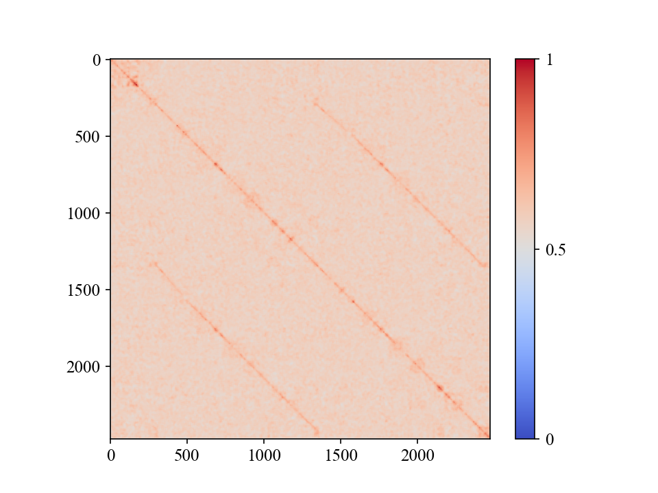

# CNNs for Loop-Closure Detection
The following is based on the methodology proposed in "*Loop closure detection for 
visual SLAM systems using convolutional neural network*" (see citation below). Various
CNN architectures are available for method evaluation on the Oxford *New College* and
*City Centre* datasets. The code can easily be extended for additional datasets and 
CNNs.




X. Zhang, Y. Su and X. Zhu, "Loop closure detection for visual SLAM systems using convolutional neural network," 2017 23rd International Conference on Automation and Computing (ICAC), Huddersfield, 2017, pp. 1-6.
doi: 10.23919/IConAC.2017.8082072

# Usage
The main script is `cnn_lcd.py` and offers the following options.
```
python cnn_lcd.py --help
usage: cnn_lcd.py [-h] [--dataset DATASET] [--overfeat OVERFEAT]
                  [--weights_dir WEIGHTS_DIR] [--weights_base WEIGHTS_BASE]
                  [--layer LAYER] [--plot_gt] [--cluster] [--sweep_median]
                  [--debug]
                  model

CNNs for loop-closure detection.

positional arguments:
  model                 Model name: [overfeat, inception_v{1,2,3,4}, nasnet,
                        resnet_v2_152]

optional arguments:
  -h, --help            show this help message and exit
  --dataset DATASET     Either "city" or "college".
  --overfeat OVERFEAT   0 for small network, 1 for large
  --weights_dir WEIGHTS_DIR
                        Weights directory.
  --weights_base WEIGHTS_BASE
                        Basename of weights file.
  --layer LAYER         Layer number to extract features from.
  --plot_gt             Plots heat-map of ground truth and exits
  --cluster             Additionally performs clustering on sim matrix.
  --sweep_median        Sweep median filter size values.
  --debug               Use small number of images to debug code
```
Note that you need to run the script with python2 to use the *OverFeat* model, and
python3 to use the TensorFlow models.


# Installation/Requirements
The following Python packages are needed (installed with pip, conda, etc.):
* tensorflow
* numpy
* scipy
* skimage
* matplotlib
* sklearn

Additionally, in order to use the *Overfeat* model, you'll need to install
the Python API provided [here][1]. The GPU version should ideally be installed, but 
the authors only provide the source for the CPU version. *OverFeat* also has a 
TensorFlow implementation, but does not offer pre-trained checkpoint files. The 
repository provides package installation instructions.

In order to use the TensorFlow models (everything but *OverFeat*), you will need 
to clone the [TensorFlow Slim model repository][2]. The easiest way to do so is 
to clone both this repository and the TensorFlow models repository to the same 
directory:

```
git clone https://github.com/tensorflow/models/
git clone <THIS REPO>
```
Directory structure should look like this:
```
+ models/
|--- ...
|--- slim
|--- ...
| cnn_lcd.py
| ...
```


[1]: https://github.com/sermanet/OverFeat
[2]: https://github.com/tensorflow/models/tree/master/research/slim
